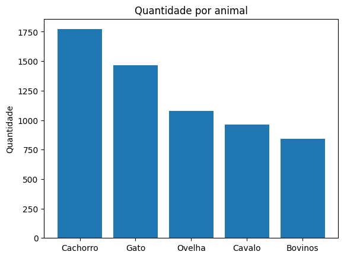
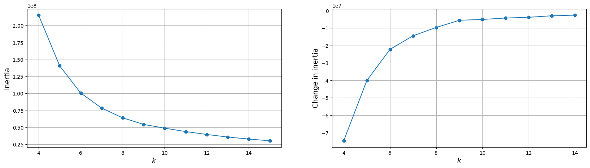
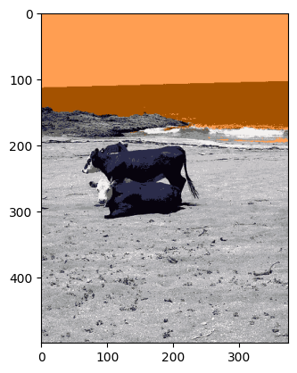
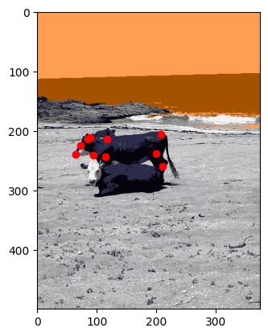

# 1 - Análise exploratória
Primeiramente printei uma imagem de cada categoria, podemos ver que as categorias são:
 - 1: cachorro
 - 2: gato
 - 3: ovelha
 - 4: cavalo
 - 5: bovinos

Após isso, fiz um gráfico que mostra quantas imagens tem por categoria. São 1771 imagens de cachorros, 1466 de gatos, 1078 de ovelhas, 960 de cavalos e 842 de bovinos.

Para separar as imagens de bovinos do resto dos dados, eu usei um laço para passar por cada lista de anotações de imagem. A cada iteração eu confiro se a categoria da imagem é a 5 (a categoria de bovinos), caso ela seja, eu uso o id da imagem como chave para buscar o valor (que é o nome da imagem) em um dicionário com todos os nomes de imagem do dataset. Após recuperar o nome da imagem, eu construo o caminho inteiro da imagem e salvo em uma lista.

Verifiquei também o tamanho das imagens dos bovinos. A altura mínima é de 141px e a altura máxima é 500px. Já a largura mínima é de 192px e a largura máxima é de 500px. A largura mais comum nessas imagens é de 500px, com uma frequencia de 556 vezes que ela aparece nas imagens, enquanto a de altura é de 375 com 283 aparições.

# 2 - Processamento

Processei a imagem utilizando kmeans. Utilizei uma imagem para testar qual o melhor valor de K e usei também o método do cotovelo. O método consiste em testar alguns valores de K e verificar onde a diferença de valor de K passa a ter pouco efeito na imagem. Para isso então eu vetorizo a imagem, convertendo-a em uma matriz 2D de pixels, defino a lista de números que serão testados, e para cada valor de K, eu trato a imagem e guardo o valor da inércia. Isso resulta o seguinte gráfico: 

Podemos perceber que a partir do valor de k igual a 9, a mudança é bem pequena, então esse é o valor utilizado.

Eu uso um laço para usar o kmeans em cada imagem de bovinos, normalizo a imagem e depois a salvo em uma lista. 

A imagem acima é a imagem gerada após a normalizacão e o uso do kmeans.

# 3 - Resultados

Após isso, gerei a imagem com os pontos chave do bovino que está em pé na imagem:

O resultado então é a imagem acima, tratada com Kmeans, normalizada e com os pontos chave do pose estimation.

# 4 - Conclusões

Os principais aprendizados foram sobre o tratamento de um json de pose estimation, que foi bem confuso no início, mas o principal apredizado/ limitação foi usar um modelo de pose estimation. Eu tentei utilizar o modelo do professor raphael no link: https://colab.research.google.com/drive/1xCUl3QS1hcugulEjPzg4iFzYQMUOS_TU?authuser=1#scrollTo=wUDsON14FSo4
mas ele apenas detecta pessoas, como eu fiz no teste do colab em que uma imagem de cavalo que tem uma pessoa, ele detectou a pessoa mas na de bovino, não detectou nada. Tentei utilizar vários modelos como o próprio open pose mas não consegui entender e utilizar. O link ligado a ponderada também achei muito confuso e não foi útil. Esse então seria um trabalho futuro: aplicar um modelo de pose estimation.